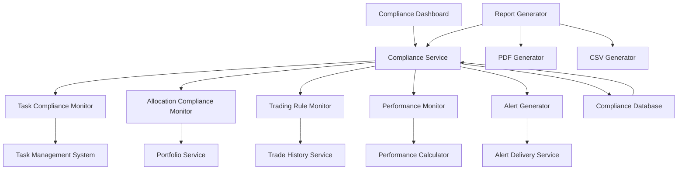

# Design Document

## Overview

The Compliance Reporting feature provides real-time metrics and trend analysis to ensure adherence to investment discipline and regulatory requirements. The system integrates with the Task Management, Portfolio Tracking, and Trade Ticket Builder components to monitor task completion, portfolio allocation limits, trading rules, and performance metrics. It identifies potential compliance issues before they become problems through automated monitoring, alerting, and reporting.

## Architecture

### High-Level Architecture



### Integration Points

1. **Task Management System**: Retrieves task completion data for compliance tracking
2. **Portfolio Service**: Monitors portfolio allocation against defined limits
3. **Trade History Service**: Analyzes trading activity for rule compliance
4. **Performance Calculator**: Compares actual performance against targets
5. **Alert Delivery Service**: Distributes compliance alerts through various channels

## Components and Interfaces

### 1. ComplianceService

The core service responsible for compliance monitoring and reporting.

```python
class ComplianceService:
    """Service for compliance monitoring and reporting"""
    
    def __init__(
        self,
        task_monitor: TaskComplianceMonitor,
        allocation_monitor: AllocationComplianceMonitor,
        trading_monitor: TradingRuleMonitor,
        performance_monitor: PerformanceMonitor,
        alert_generator: AlertGenerator,
        db: Session
    ):
        self.task_monitor = task_monitor
        self.allocation_monitor = allocation_monitor
        self.trading_monitor = trading_monitor
        self.performance_monitor = performance_monitor
        self.alert_generator = alert_generator
        self.db = db
    
    async def get_compliance_summary(self, user_id: str) -> ComplianceSummary:
        """Get overall compliance summary"""
        # Implementation
    
    async def check_compliance(self, user_id: str) -> ComplianceCheckResult:
        """Run comprehensive compliance check"""
        # Implementation
    
    async def get_compliance_history(
        self, user_id: str, metric_type: str, timeframe: str
    ) -> List[ComplianceMetric]:
        """Get historical compliance metrics"""
        # Implementation
    
    async def generate_compliance_report(
        self, user_id: str, report_type: str, params: dict
    ) -> ComplianceReport:
        """Generate compliance report"""
        # Implementation
```

### 2. TaskComplianceMonitor

Monitors task completion for compliance with workflow requirements.

```python
class TaskComplianceMonitor:
    """Monitor for task completion compliance"""
    
    def __init__(self, task_service: TaskService, db: Session):
        self.task_service = task_service
        self.db = db
    
    async def get_task_compliance_metrics(
        self, user_id: str, timeframe: str
    ) -> TaskComplianceMetrics:
        """Get task compliance metrics"""
        # Implementation
    
    async def analyze_task_patterns(
        self, user_id: str, lookback_weeks: int = 12
    ) -> TaskPatternAnalysis:
        """Analyze patterns in task completion"""
        # Implementation
    
    async def check_blocking_task_compliance(
        self, user_id: str
    ) -> BlockingTaskCompliance:
        """Check compliance with blocking tasks"""
        # Implementation
```

### 3. AllocationComplianceMonitor

Monitors portfolio allocation against defined limits.

```python
class AllocationComplianceMonitor:
    """Monitor for portfolio allocation compliance"""
    
    def __init__(self, portfolio_service: PortfolioService, db: Session):
        self.portfolio_service = portfolio_service
        self.db = db
    
    async def get_allocation_compliance(
        self, user_id: str
    ) -> AllocationComplianceResult:
        """Get current allocation compliance status"""
        # Implementation
    
    async def check_allocation_limits(
        self, user_id: str, portfolio: Portfolio
    ) -> List[AllocationViolation]:
        """Check portfolio against allocation limits"""
        # Implementation
    
    async def track_allocation_drift(
        self, user_id: str, lookback_days: int = 90
    ) -> AllocationDriftAnalysis:
        """Track allocation drift over time"""
        # Implementation
```

### 4. TradingRuleMonitor

Monitors trading activity for compliance with defined rules.

```python
class TradingRuleMonitor:
    """Monitor for trading rule compliance"""
    
    def __init__(self, trade_service: TradeService, db: Session):
        self.trade_service = trade_service
        self.db = db
    
    async def get_trading_compliance(
        self, user_id: str
    ) -> TradingComplianceResult:
        """Get current trading rule compliance status"""
        # Implementation
    
    async def validate_trade(
        self, user_id: str, trade: TradeOrder
    ) -> TradeValidationResult:
        """Validate trade against trading rules"""
        # Implementation
    
    async def analyze_trading_patterns(
        self, user_id: str, lookback_days: int = 90
    ) -> TradingPatternAnalysis:
        """Analyze patterns in trading activity"""
        # Implementation
```

## Data Models

### ComplianceSummary Model

```python
class ComplianceSummary(BaseModel):
    """Overall compliance summary"""
    user_id: str
    overall_score: float  # 0-100 compliance score
    task_compliance: TaskComplianceMetrics
    allocation_compliance: AllocationComplianceResult
    trading_compliance: TradingComplianceResult
    performance_compliance: PerformanceComplianceResult
    active_alerts: int
    critical_alerts: int
    last_updated: datetime
```

### TaskComplianceMetrics Model

```python
class TaskComplianceMetrics(BaseModel):
    """Task compliance metrics"""
    daily_completion_rate: float
    weekly_completion_rate: float
    monthly_completion_rate: float
    blocking_task_completion_rate: float
    missed_tasks_count: int
    overdue_tasks_count: int
    compliance_trend: List[ComplianceDataPoint]
    problem_areas: List[TaskProblemArea]
```

### AllocationComplianceResult Model

```python
class AllocationComplianceResult(BaseModel):
    """Allocation compliance result"""
    is_compliant: bool
    violations: List[AllocationViolation]
    drift_metrics: Dict[str, float]
    days_out_of_compliance: int
    last_rebalance_date: Optional[date]
    suggested_actions: List[SuggestedAction]
```

### ComplianceAlert Model

```python
class ComplianceAlert(BaseModel):
    """Compliance alert model"""
    id: str
    user_id: str
    alert_type: str  # task, allocation, trading, performance
    severity: str  # info, warning, critical
    title: str
    description: str
    details: Dict[str, Any]
    suggested_action: Optional[str]
    is_resolved: bool
    resolution_notes: Optional[str]
    created_at: datetime
    resolved_at: Optional[datetime]
```

## API Endpoints

### Compliance Summary Endpoints

```
GET /api/compliance/summary
  - Query parameters:
    - user_id: User identifier
  - Returns: ComplianceSummary object

POST /api/compliance/check
  - Query parameters:
    - user_id: User identifier
  - Returns: ComplianceCheckResult object
```

### Task Compliance Endpoints

```
GET /api/compliance/tasks
  - Query parameters:
    - user_id: User identifier
    - timeframe: daily, weekly, monthly, all
  - Returns: TaskComplianceMetrics object

GET /api/compliance/tasks/patterns
  - Query parameters:
    - user_id: User identifier
    - lookback_weeks: Number of weeks to analyze
  - Returns: TaskPatternAnalysis object
```

### Alert Endpoints

```
GET /api/compliance/alerts
  - Query parameters:
    - user_id: User identifier
    - status: active, resolved, all
    - severity: info, warning, critical, all
    - type: task, allocation, trading, performance, all
  - Returns: List of ComplianceAlert objects

POST /api/compliance/alerts/{alert_id}/resolve
  - Request body:
    - resolution_notes: Notes about resolution
  - Returns: Updated ComplianceAlert object
```

## UI Design

### Compliance Dashboard Layout

```
+-------------------------------------------------------+
| Compliance Summary                           [Refresh]|
+-------------------------------------------------------+
| Overall Score: XX/100                                 |
|                                                       |
| +-------------------+  +-------------------------+    |
| | Task Compliance   |  | Allocation Compliance   |    |
| | Daily: XX%        |  | Status: Compliant/      |    |
| | Weekly: XX%       |  |        Non-Compliant    |    |
| | Monthly: XX%      |  | Violations: X           |    |
| | [View Details]    |  | [View Details]          |    |
| +-------------------+  +-------------------------+    |
|                                                       |
| +-------------------+  +-------------------------+    |
| | Trading Compliance|  | Performance Compliance  |    |
| | Status: Compliant/|  | Status: Compliant/      |    |
| |        Non-Compl. |  |        Non-Compliant    |    |
| | Violations: X     |  | Variances: X            |    |
| | [View Details]    |  | [View Details]          |    |
| +-------------------+  +-------------------------+    |
|                                                       |
+-------------------------------------------------------+
| Active Alerts (X)                            [View All]|
+-------------------------------------------------------+
| [!] Critical: Portfolio allocation exceeds limits     |
| [!] Warning: Weekly task completion below threshold   |
| [i] Info: Performance variance in small-cap allocation|
|                                                       |
+-------------------------------------------------------+
```

## Scheduler Design

The compliance checking is scheduled using the APScheduler service:

```python
def schedule_compliance_jobs(scheduler: AsyncIOScheduler):
    """Schedule compliance monitoring jobs"""
    
    # Schedule daily compliance check
    scheduler.add_job(
        check_all_compliance,
        trigger="cron",
        hour=0,
        minute=0,
        id="daily_compliance_check",
        replace_existing=True,
    )
    
    # Schedule intraday allocation check (every 4 hours)
    scheduler.add_job(
        check_allocation_compliance,
        trigger="cron",
        hour="*/4",
        id="allocation_compliance_check",
        replace_existing=True,
    )
```

## Error Handling

1. **Data Retrieval Errors**:
   - Use cached compliance data if current data cannot be retrieved
   - Log detailed error information for troubleshooting
   - Display error indicators in the UI with last successful check time

2. **Rule Evaluation Errors**:
   - Skip problematic rules but continue evaluating others
   - Log specific rule evaluation failures
   - Flag rules that consistently fail for review

## Testing Strategy

1. **Unit Tests**:
   - Test rule evaluation logic
   - Test compliance calculation algorithms
   - Test alert generation and grouping

2. **Integration Tests**:
   - Test integration with task, portfolio, and trading systems
   - Test report generation with various parameters
   - Test alert delivery through different channels

3. **End-to-End Tests**:
   - Test complete compliance monitoring workflow
   - Test dashboard display and interaction
   - Test report generation and download