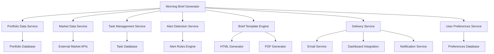

# Design Document

## Overview

The Morning Brief System provides users with a comprehensive daily summary of portfolio performance, market conditions, scheduled tasks, and actionable alerts. The system automatically generates and delivers this information through multiple channels before market open, enabling users to start their day with a clear understanding of their financial position and required actions.

## Architecture

### High-Level Architecture



### Integration Points

1. **Portfolio Service**: Retrieves current portfolio data and performance metrics
2. **Market Data Service**: Fetches market indices, futures, and relevant news
3. **Task Management System**: Gets daily tasks and their status
4. **Alert Detection Service**: Identifies anomalies and opportunities
5. **User Preferences Service**: Retrieves customization settings

## Components and Interfaces

### 1. MorningBriefGenerator Service

The core service responsible for assembling the morning brief content.

```python
class MorningBriefGenerator:
    """Service for generating morning briefs"""
    
    def __init__(
        self,
        portfolio_service: PortfolioService,
        market_service: MarketDataService,
        task_service: TaskService,
        alert_service: AlertService,
        preferences_service: UserPreferencesService,
        template_engine: TemplateEngine
    ):
        self.portfolio_service = portfolio_service
        self.market_service = market_service
        self.task_service = task_service
        self.alert_service = alert_service
        self.preferences_service = preferences_service
        self.template_engine = template_engine
    
    async def generate_brief(self, user_id: str) -> MorningBrief:
        """Generate a morning brief for the specified user"""
        # Implementation
    
    async def _get_portfolio_summary(self, user_id: str) -> PortfolioSummary:
        """Get portfolio summary for the brief"""
        # Implementation
    
    async def _get_market_data(self, user_id: str) -> MarketData:
        """Get relevant market data for the brief"""
        # Implementation
    
    async def _get_daily_tasks(self, user_id: str) -> List[TaskSummary]:
        """Get tasks due today"""
        # Implementation
    
    async def _get_alerts(self, user_id: str) -> List[Alert]:
        """Get relevant alerts for the brief"""
        # Implementation
```

### 2. MorningBriefDeliveryService

Handles the delivery of morning briefs through various channels.

```python
class MorningBriefDeliveryService:
    """Service for delivering morning briefs"""
    
    def __init__(
        self,
        email_service: EmailService,
        notification_service: NotificationService,
        html_generator: HtmlGenerator,
        pdf_generator: PdfGenerator
    ):
        self.email_service = email_service
        self.notification_service = notification_service
        self.html_generator = html_generator
        self.pdf_generator = pdf_generator
    
    async def deliver_brief(self, brief: MorningBrief, user_id: str) -> DeliveryResult:
        """Deliver the morning brief through configured channels"""
        # Implementation
    
    async def _send_email(self, brief: MorningBrief, user_id: str) -> bool:
        """Send brief via email"""
        # Implementation
    
    async def _send_notification(self, brief: MorningBrief, user_id: str) -> bool:
        """Send notification about new brief"""
        # Implementation
    
    async def _store_for_dashboard(self, brief: MorningBrief, user_id: str) -> bool:
        """Store brief for dashboard display"""
        # Implementation
```

### 3. MorningBriefCard Component

Frontend component for displaying the morning brief in the dashboard.

```typescript
interface MorningBriefCardProps {
  briefId?: string;
  userId: string;
  isExpanded?: boolean;
  onExpandToggle?: (expanded: boolean) => void;
  refreshInterval?: number;
}

const MorningBriefCard: React.FC<MorningBriefCardProps> = ({
  briefId,
  userId,
  isExpanded = false,
  onExpandToggle,
  refreshInterval = 0
}) => {
  // Component implementation
};
```

### 4. PortfolioSummarySection Component

Displays portfolio performance metrics in the brief.

```typescript
interface PortfolioSummarySectionProps {
  portfolioSummary: PortfolioSummary;
  isInteractive?: boolean;
}

const PortfolioSummarySection: React.FC<PortfolioSummarySectionProps> = ({
  portfolioSummary,
  isInteractive = false
}) => {
  // Component implementation
};
```

### 5. MarketDataSection Component

Shows market indices and relevant news.

```typescript
interface MarketDataSectionProps {
  marketData: MarketData;
  isInteractive?: boolean;
}

const MarketDataSection: React.FC<MarketDataSectionProps> = ({
  marketData,
  isInteractive = false
}) => {
  // Component implementation
};
```

### 6. TaskListSection Component

Displays tasks due today with completion options.

```typescript
interface TaskListSectionProps {
  tasks: TaskSummary[];
  onTaskAction?: (taskId: number, action: TaskAction) => void;
  isInteractive?: boolean;
}

const TaskListSection: React.FC<TaskListSectionProps> = ({
  tasks,
  onTaskAction,
  isInteractive = false
}) => {
  // Component implementation
};
```

### 7. AlertsSection Component

Shows portfolio alerts and anomalies.

```typescript
interface AlertsSectionProps {
  alerts: Alert[];
  onAlertAction?: (alertId: string, action: string) => void;
  isInteractive?: boolean;
}

const AlertsSection: React.FC<AlertsSectionProps> = ({
  alerts,
  onAlertAction,
  isInteractive = false
}) => {
  // Component implementation
};
```

## Data Models

### MorningBrief Model

```python
class MorningBrief(BaseModel):
    """Morning brief data model"""
    id: str
    user_id: str
    generation_time: datetime
    portfolio_summary: PortfolioSummary
    market_data: MarketData
    tasks: List[TaskSummary]
    alerts: List[Alert]
    delivery_status: Dict[str, DeliveryStatus]
```

### PortfolioSummary Model

```python
class PortfolioSummary(BaseModel):
    """Portfolio summary for morning brief"""
    total_value: float
    daily_change: float
    daily_change_percent: float
    weekly_change_percent: float
    monthly_change_percent: float
    ytd_change_percent: float
    benchmark_comparison: Dict[str, float]  # e.g., {"S&P 500": -1.2}
    asset_allocation: Dict[str, float]  # e.g., {"stocks": 65.2, "bonds": 20.1}
    brokerage_breakdown: Dict[str, float]  # e.g., {"fidelity": 250000, "robinhood": 50000}
    top_performers: List[AssetPerformance]
    worst_performers: List[AssetPerformance]
    last_updated: datetime
```

### MarketData Model

```python
class MarketData(BaseModel):
    """Market data for morning brief"""
    indices: Dict[str, IndexData]  # e.g., {"S&P 500": {...}, "NASDAQ": {...}}
    futures: Dict[str, FutureData]  # e.g., {"ES": {...}, "NQ": {...}}
    forex: Dict[str, ForexData]  # e.g., {"EUR/USD": {...}, "USD/JPY": {...}}
    commodities: Dict[str, CommodityData]  # e.g., {"Gold": {...}, "Oil": {...}}
    news: List[NewsItem]
    market_calendar: MarketCalendar
    last_updated: datetime
```

### TaskSummary Model

```python
class TaskSummary(BaseModel):
    """Task summary for morning brief"""
    id: int
    name: str
    description: Optional[str]
    due_time: datetime
    is_blocking: bool
    priority: int
    category: str
    status: str
    is_overdue: bool
```

### Alert Model

```python
class Alert(BaseModel):
    """Alert for morning brief"""
    id: str
    type: str  # e.g., "price_movement", "allocation_drift", "earnings_announcement"
    severity: str  # "info", "warning", "critical"
    title: str
    description: str
    asset_id: Optional[str]
    asset_name: Optional[str]
    suggested_action: Optional[str]
    action_url: Optional[str]
```

### UserBriefPreferences Model

```python
class UserBriefPreferences(BaseModel):
    """User preferences for morning brief"""
    user_id: str
    enabled_sections: List[str]  # e.g., ["portfolio", "market", "tasks", "alerts"]
    section_priorities: Dict[str, int]  # e.g., {"portfolio": 1, "tasks": 2}
    delivery_channels: List[str]  # e.g., ["email", "dashboard", "notification"]
    delivery_time: str  # e.g., "08:00"
    email_address: Optional[str]
    include_pdf: bool
    market_indices: List[str]  # e.g., ["S&P 500", "NASDAQ", "Dow Jones"]
    news_sources: List[str]
    news_keywords: List[str]
```

## API Endpoints

### Morning Brief Endpoints

```
GET /api/morning-brief/latest
  - Query parameters:
    - user_id: User identifier
  - Returns: Latest MorningBrief object

GET /api/morning-brief/{brief_id}
  - Returns: MorningBrief by ID

GET /api/morning-brief/history
  - Query parameters:
    - user_id: User identifier
    - limit: Maximum number of briefs to return
    - offset: Pagination offset
  - Returns: List of MorningBrief objects

POST /api/morning-brief/generate
  - Request body:
    - user_id: User identifier
  - Returns: Generated MorningBrief

POST /api/morning-brief/{brief_id}/deliver
  - Query parameters:
    - channels: List of delivery channels
  - Returns: DeliveryResult
```

### Preferences Endpoints

```
GET /api/morning-brief/preferences
  - Query parameters:
    - user_id: User identifier
  - Returns: UserBriefPreferences

PUT /api/morning-brief/preferences
  - Request body: UserBriefPreferences
  - Returns: Updated UserBriefPreferences

POST /api/morning-brief/preferences/preview
  - Request body: UserBriefPreferences
  - Returns: Preview of MorningBrief with applied preferences
```

## Email Template Design

### Email Layout

```
+-------------------------------------------------------+
| AIMS Morning Brief - [Date]                           |
+-------------------------------------------------------+
|                                                       |
| Portfolio Summary                                     |
| ----------------                                      |
| Total Value: $XXX,XXX (+/-X.X%)                       |
| Daily Change: +/-$X,XXX (+/-X.X%)                     |
| vs S&P 500: +/-X.X%                                   |
|                                                       |
| [Mini Asset Allocation Chart]                         |
|                                                       |
+-------------------------------------------------------+
|                                                       |
| Market Summary                                        |
| --------------                                        |
| S&P 500: X,XXX.XX (+/-X.X%)                           |
| NASDAQ: XX,XXX.XX (+/-X.X%)                           |
| Dow Jones: XX,XXX.XX (+/-X.X%)                        |
|                                                       |
| Top Headlines:                                        |
| - Headline 1                                          |
| - Headline 2                                          |
|                                                       |
+-------------------------------------------------------+
|                                                       |
| Today's Tasks (X pending)                             |
| ----------------------                                |
| [ ] Task 1 - High Priority                            |
| [ ] Task 2 - Medium Priority                          |
| [ ] Task 3 - Low Priority                             |
|                                                       |
+-------------------------------------------------------+
|                                                       |
| Alerts (X new)                                        |
| -------------                                         |
| [!] Alert 1 - Critical                                |
| [!] Alert 2 - Warning                                 |
|                                                       |
+-------------------------------------------------------+
|                                                       |
| [View Full Brief in Dashboard]                        |
|                                                       |
+-------------------------------------------------------+
```

## Dashboard Card Design

### Collapsed State

```
+-------------------------------------------------------+
| Morning Brief - July 16, 2025                     [↓] |
+-------------------------------------------------------+
| Portfolio: $XXX,XXX (+/-X.X%)                         |
| S&P 500: X,XXX.XX (+/-X.X%)                           |
| Tasks: X pending (X blocking)                         |
| Alerts: X new (X critical)                            |
+-------------------------------------------------------+
```

### Expanded State

```
+-------------------------------------------------------+
| Morning Brief - July 16, 2025                     [↑] |
+-------------------------------------------------------+
|                                                       |
| Portfolio Summary                                     |
| ----------------                                      |
| Total Value: $XXX,XXX                                 |
| Daily Change: +/-$X,XXX (+/-X.X%)                     |
| Weekly Change: +/-X.X%                                |
| Monthly Change: +/-X.X%                               |
| YTD Change: +/-X.X%                                   |
|                                                       |
| vs Benchmarks:                                        |
| - S&P 500: +/-X.X%                                    |
| - NASDAQ: +/-X.X%                                     |
|                                                       |
| [Asset Allocation Chart]    [Brokerage Breakdown]     |
|                                                       |
| Top Performers:                                       |
| 1. Asset A: +X.X%                                     |
| 2. Asset B: +X.X%                                     |
|                                                       |
| Worst Performers:                                     |
| 1. Asset Y: -X.X%                                     |
| 2. Asset Z: -X.X%                                     |
|                                                       |
+-------------------------------------------------------+
|                                                       |
| Market Summary                                        |
| --------------                                        |
| [Mini Chart: S&P 500]                                 |
| S&P 500: X,XXX.XX (+/-X.X%)                           |
| NASDAQ: XX,XXX.XX (+/-X.X%)                           |
| Dow Jones: XX,XXX.XX (+/-X.X%)                        |
|                                                       |
| Futures:                                              |
| - S&P 500: +/-X.X%                                    |
| - NASDAQ: +/-X.X%                                     |
|                                                       |
| Top Headlines:                                        |
| - Headline 1 [Link]                                   |
| - Headline 2 [Link]                                   |
| - Headline 3 [Link]                                   |
|                                                       |
| [View More Market Data]                               |
|                                                       |
+-------------------------------------------------------+
|                                                       |
| Today's Tasks (X pending)                             |
| ----------------------                                |
| [ ] Task 1 - High Priority - Due 10:00 AM [Complete]  |
| [ ] Task 2 - Medium Priority - Due 2:00 PM [Complete] |
| [ ] Task 3 - Low Priority - Due 4:00 PM [Complete]    |
|                                                       |
| [View All Tasks]                                      |
|                                                       |
+-------------------------------------------------------+
|                                                       |
| Alerts (X new)                                        |
| -------------                                         |
| [!] Alert 1 - Critical - Asset X down 7% [Details]    |
| [!] Alert 2 - Warning - Portfolio drift 4% [Details]  |
|                                                       |
| [View All Alerts]                                     |
|                                                       |
+-------------------------------------------------------+
|                                                       |
| [Download PDF] [Send to Email] [Customize]            |
|                                                       |
+-------------------------------------------------------+
```

## Scheduler Design

The Morning Brief generation is scheduled using the APScheduler service:

```python
def schedule_morning_brief_jobs(scheduler: AsyncIOScheduler):
    """Schedule morning brief generation jobs"""
    
    # Schedule generation job before market open
    scheduler.add_job(
        generate_morning_briefs,
        trigger="cron",
        hour=7,
        minute=0,
        id="morning_brief_generation",
        replace_existing=True,
    )
    
    # Schedule delivery job after generation
    scheduler.add_job(
        deliver_morning_briefs,
        trigger="cron",
        hour=7,
        minute=15,
        id="morning_brief_delivery",
        replace_existing=True,
    )
```

## Error Handling

1. **Data Retrieval Errors**:
   - Include partial data with error indicators
   - Show last successful data with timestamp
   - Log detailed error information

2. **Generation Errors**:
   - Retry with exponential backoff
   - Fall back to simplified brief if full generation fails
   - Alert operations team for persistent failures

3. **Delivery Errors**:
   - Attempt alternative delivery channels
   - Store brief for dashboard access regardless of delivery status
   - Provide manual delivery option in dashboard

## Testing Strategy

1. **Unit Tests**:
   - Test brief generation logic
   - Test template rendering
   - Test delivery mechanisms

2. **Integration Tests**:
   - Test data retrieval from services
   - Test scheduler integration
   - Test email delivery

3. **End-to-End Tests**:
   - Test complete brief generation and delivery
   - Test user preference application
   - Test dashboard display

4. **Mock Data Testing**:
   - Create mock data sources for testing
   - Test various market scenarios
   - Test alert generation logic