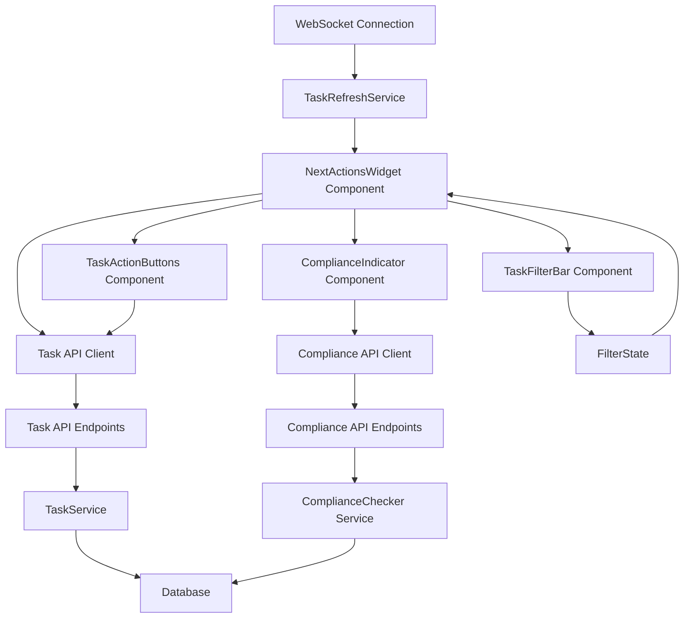

# Design Document

## Overview

The Next Actions Dashboard provides a real-time view of pending tasks with color-coded status indicators and compliance metrics. It integrates with the existing Task Management System to display tasks from various categories with appropriate visual cues for priority, status, and due dates. The dashboard is designed to be the central hub for daily operations, enabling users to quickly identify and act on pending tasks.

## Architecture

### High-Level Architecture



### Integration Points

1. **Task Management System**: Fetches task data from the existing TaskService
2. **Compliance Checker**: Retrieves compliance metrics from the ComplianceChecker service
3. **WebSocket Service**: Enables real-time updates when tasks are modified
4. **User Authentication**: Ensures tasks are filtered by the current user's permissions

## Components and Interfaces

### 1. NextActionsWidget Component

The main dashboard component that orchestrates the display of tasks and related metrics.

```typescript
interface NextActionsWidgetProps {
  initialTasks?: TaskInstance[];
  refreshInterval?: number;
  showCompliance?: boolean;
  showFilters?: boolean;
  maxItems?: number;
  onTaskAction?: (taskId: number, action: TaskAction) => void;
}

const NextActionsWidget: React.FC<NextActionsWidgetProps> = ({
  initialTasks,
  refreshInterval = 30000,
  showCompliance = true,
  showFilters = true,
  maxItems,
  onTaskAction
}) => {
  // Component implementation
};
```

### 2. TaskList Component

Displays the list of tasks with appropriate styling based on status and priority.

```typescript
interface TaskListProps {
  tasks: TaskInstance[];
  onTaskAction: (taskId: number, action: TaskAction) => void;
  emptyMessage?: string;
  showCategory?: boolean;
  showPriority?: boolean;
}

const TaskList: React.FC<TaskListProps> = ({
  tasks,
  onTaskAction,
  emptyMessage = "No tasks found",
  showCategory = true,
  showPriority = true
}) => {
  // Component implementation
};
```

### 3. TaskItem Component

Renders an individual task with status indicators and action buttons.

```typescript
interface TaskItemProps {
  task: TaskInstance;
  onAction: (action: TaskAction) => void;
  showCategory?: boolean;
  showPriority?: boolean;
}

const TaskItem: React.FC<TaskItemProps> = ({
  task,
  onAction,
  showCategory,
  showPriority
}) => {
  // Component implementation
};
```

### 4. ComplianceIndicator Component

Displays compliance metrics with appropriate visual indicators.

```typescript
interface ComplianceIndicatorProps {
  complianceRate: number;
  dailyRate?: number;
  weeklyRate?: number;
  showDetails?: boolean;
  warningThreshold?: number;
}

const ComplianceIndicator: React.FC<ComplianceIndicatorProps> = ({
  complianceRate,
  dailyRate,
  weeklyRate,
  showDetails = false,
  warningThreshold = 90
}) => {
  // Component implementation
};
```

### 5. TaskFilterBar Component

Provides filtering and search functionality for tasks.

```typescript
interface TaskFilterBarProps {
  categories: string[];
  priorities: Priority[];
  statuses: TaskStatus[];
  onFilterChange: (filters: TaskFilters) => void;
  initialFilters?: TaskFilters;
}

const TaskFilterBar: React.FC<TaskFilterBarProps> = ({
  categories,
  priorities,
  statuses,
  onFilterChange,
  initialFilters = {}
}) => {
  // Component implementation
};
```

## Data Models

### TaskInstance Model

```typescript
interface TaskInstance {
  id: number;
  template_id: number;
  name: string;
  description?: string;
  due_date: string; // ISO date string
  status: 'pending' | 'in_progress' | 'completed' | 'skipped';
  is_blocking: boolean;
  priority: 1 | 2 | 3; // 1=high, 2=medium, 3=low
  category: string;
  completed_at?: string;
  completed_by?: string;
  notes?: string;
  color_code: 'green' | 'yellow' | 'red' | 'default';
}
```

### TaskFilters Model

```typescript
interface TaskFilters {
  categories?: string[];
  priorities?: number[];
  statuses?: string[];
  searchText?: string;
  dueDate?: {
    from?: string;
    to?: string;
  };
  isBlocking?: boolean;
}
```

### ComplianceMetrics Model

```typescript
interface ComplianceMetrics {
  overall_rate: number;
  daily_rate: number;
  weekly_rate: number;
  total_tasks: number;
  completed_tasks: number;
  overdue_tasks: number;
  blocking_tasks_complete: boolean;
}
```

## API Endpoints

### Task Endpoints

```
GET /api/tasks
  - Query parameters:
    - status: Filter by status
    - category: Filter by category
    - priority: Filter by priority
    - is_blocking: Filter blocking tasks
    - search: Search by name/description
    - due_before: Filter by due date
    - due_after: Filter by due date
  - Returns: List of TaskInstance objects

POST /api/tasks/{task_id}/complete
  - Request body:
    - notes: Optional completion notes
  - Returns: Updated TaskInstance

POST /api/tasks/{task_id}/start
  - Returns: Updated TaskInstance

POST /api/tasks/{task_id}/skip
  - Request body:
    - reason: Required reason for skipping
  - Returns: Updated TaskInstance
```

### Compliance Endpoints

```
GET /api/tasks/compliance
  - Query parameters:
    - start_date: Start of period (default: start of current week)
    - end_date: End of period (default: current date)
  - Returns: ComplianceMetrics object
```

## UI Design

### Desktop Layout

```
+-------------------------------------------------------+
| [Compliance Indicator]    [Refresh] [Filter Bar     ] |
+-------------------------------------------------------+
| Task Categories:  [All] [Daily] [Weekly] [Monthly]    |
+-------------------------------------------------------+
| [Task Count Summary]                                  |
+-------------------------------------------------------+
| Tasks:                                                |
|                                                       |
| [High] Task Name 1                     [Due] [Actions]|
| Description text...                                   |
|                                                       |
| [Med]  Task Name 2                     [Due] [Actions]|
| Description text...                                   |
|                                                       |
| [Low]  Task Name 3                     [Due] [Actions]|
| Description text...                                   |
|                                                       |
+-------------------------------------------------------+
| [Pagination Controls]                                 |
+-------------------------------------------------------+
```

### Mobile Layout

```
+---------------------------+
| [Compliance]    [Refresh] |
+---------------------------+
| [Filter Toggle]           |
+---------------------------+
| [Task Count Summary]      |
+---------------------------+
| Tasks:                    |
|                           |
| [H] Task Name 1           |
| [Due] [Actions]           |
|                           |
| [M] Task Name 2           |
| [Due] [Actions]           |
|                           |
| [L] Task Name 3           |
| [Due] [Actions]           |
|                           |
+---------------------------+
| [Load More]               |
+---------------------------+
```

## Color Coding System

- **Red**: Overdue tasks (past due date)
- **Yellow**: Tasks due today
- **Blue**: Tasks in progress
- **Green**: Completed tasks
- **Gray**: Future tasks
- **Purple Border**: Blocking tasks

## Error Handling

1. **API Errors**:
   - Display toast notifications for API failures
   - Implement retry mechanism for failed requests
   - Show placeholder content during loading states

2. **Empty States**:
   - Display appropriate messages when no tasks match filters
   - Provide guidance on how to create new tasks

3. **Offline Handling**:
   - Cache task data for offline viewing
   - Queue task status changes for sync when back online

## Performance Considerations

1. **Pagination**:
   - Implement virtual scrolling for large task lists
   - Limit initial load to 20-30 tasks

2. **Caching**:
   - Cache task data with React Query
   - Implement optimistic UI updates

3. **Real-time Updates**:
   - Use WebSockets for real-time task updates
   - Batch updates to minimize re-renders

## Accessibility

1. **Keyboard Navigation**:
   - Ensure all interactive elements are keyboard accessible
   - Implement proper focus management

2. **Screen Readers**:
   - Add appropriate ARIA labels
   - Ensure status changes are announced

3. **Color Contrast**:
   - Ensure all color combinations meet WCAG AA standards
   - Provide alternative indicators beyond color

## Testing Strategy

1. **Unit Tests**:
   - Test individual components in isolation
   - Verify correct rendering based on props

2. **Integration Tests**:
   - Test component interactions
   - Verify API integration

3. **End-to-End Tests**:
   - Test complete user flows
   - Verify real-time updates

4. **Accessibility Tests**:
   - Automated accessibility testing
   - Manual screen reader testing