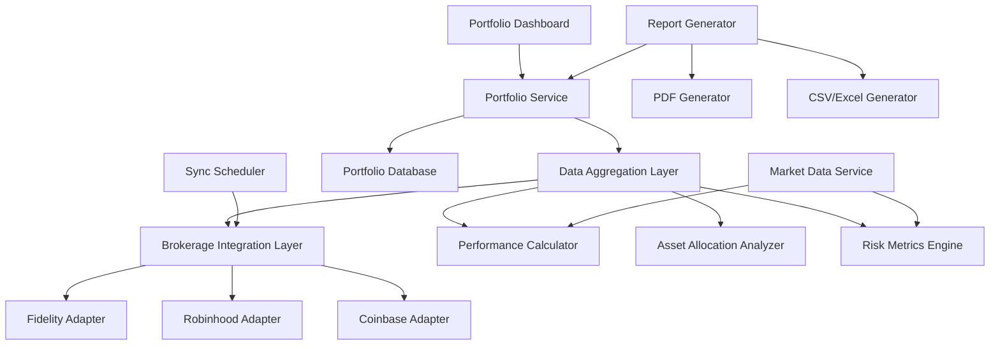

# Design Document

## Overview

The Portfolio Tracking feature provides a consolidated view of investments across multiple brokerages, enabling users to monitor their entire portfolio in one place. The system integrates with Fidelity, Robinhood, and Coinbase APIs to retrieve account data, calculates performance metrics, analyzes asset allocation, and presents the information through an intuitive dashboard interface. This feature serves as the foundation for other AIMS components by providing accurate and up-to-date portfolio data.

## Architecture

### High-Level Architecture



### Integration Points

1. **Brokerage APIs**: Connects to Fidelity, Robinhood, and Coinbase for account data
2. **Market Data Service**: Retrieves market data for performance comparison and risk analysis
3. **Task Management System**: Integrates with portfolio rebalancing tasks
4. **Morning Brief System**: Provides portfolio data for daily summaries
5. **Trade Ticket Builder**: Uses portfolio data for trade validation

## Components and Interfaces

### 1. Portfolio Service

The core service responsible for portfolio data management and operations.

```python
class PortfolioService:
    """Service for portfolio operations"""
    
    def __init__(
        self,
        brokerage_service: BrokerageService,
        performance_calculator: PerformanceCalculator,
        allocation_analyzer: AllocationAnalyzer,
        risk_metrics_engine: RiskMetricsEngine,
        db: Session
    ):
        self.brokerage_service = brokerage_service
        self.performance_calculator = performance_calculator
        self.allocation_analyzer = allocation_analyzer
        self.risk_metrics_engine = risk_metrics_engine
        self.db = db
    
    async def get_portfolio_summary(self, user_id: str) -> PortfolioSummary:
        """Get consolidated portfolio summary"""
        # Implementation
    
    async def get_holdings(self, user_id: str, filters: dict = None) -> List[Holding]:
        """Get portfolio holdings with optional filtering"""
        # Implementation
    
    async def get_performance_metrics(
        self, user_id: str, timeframe: str, benchmark: str = None
    ) -> PerformanceMetrics:
        """Get portfolio performance metrics"""
        # Implementation
    
    async def get_asset_allocation(self, user_id: str) -> AssetAllocation:
        """Get portfolio asset allocation analysis"""
        # Implementation
    
    async def get_risk_metrics(self, user_id: str) -> RiskMetrics:
        """Get portfolio risk metrics"""
        # Implementation
    
    async def generate_report(
        self, user_id: str, report_type: str, params: dict
    ) -> Report:
        """Generate portfolio report"""
        # Implementation
```

### 2. BrokerageService

Manages connections to brokerage accounts and data synchronization.

```python
class BrokerageService:
    """Service for brokerage account operations"""
    
    def __init__(self, db: Session):
        self.db = db
        self.adapters = {
            "fidelity": FidelityAdapter(),
            "robinhood": RobinhoodAdapter(),
            "coinbase": CoinbaseAdapter()
        }
    
    async def connect_account(
        self, user_id: str, brokerage_type: str, credentials: dict
    ) -> BrokerageAccount:
        """Connect a new brokerage account"""
        # Implementation
    
    async def sync_account(self, account_id: str) -> SyncResult:
        """Sync data for a specific account"""
        # Implementation
    
    async def sync_all_accounts(self, user_id: str) -> Dict[str, SyncResult]:
        """Sync data for all user accounts"""
        # Implementation
    
    async def get_accounts(self, user_id: str) -> List[BrokerageAccount]:
        """Get all brokerage accounts for a user"""
        # Implementation
    
    async def disconnect_account(self, account_id: str) -> bool:
        """Disconnect a brokerage account"""
        # Implementation
```

### 3. BrokerageAdapter (Interface)

Abstract interface for brokerage-specific adapters.

```python
class BrokerageAdapter(ABC):
    """Abstract base class for brokerage adapters"""
    
    @abstractmethod
    async def connect(self, credentials: dict) -> ConnectionResult:
        """Connect to the brokerage API"""
        pass
    
    @abstractmethod
    async def get_account_info(self, connection: Connection) -> AccountInfo:
        """Get account information"""
        pass
    
    @abstractmethod
    async def get_holdings(self, connection: Connection) -> List[Holding]:
        """Get current holdings"""
        pass
    
    @abstractmethod
    async def get_transactions(
        self, connection: Connection, start_date: date, end_date: date
    ) -> List[Transaction]:
        """Get transaction history"""
        pass
    
    @abstractmethod
    async def refresh_token(self, connection: Connection) -> Connection:
        """Refresh authentication token"""
        pass
```

### 4. PerformanceCalculator

Calculates portfolio performance metrics.

```python
class PerformanceCalculator:
    """Service for calculating portfolio performance"""
    
    def __init__(self, market_data_service: MarketDataService):
        self.market_data_service = market_data_service
    
    async def calculate_performance(
        self, holdings: List[Holding], transactions: List[Transaction], timeframe: str
    ) -> PerformanceMetrics:
        """Calculate performance metrics for a portfolio"""
        # Implementation
    
    async def calculate_benchmark_comparison(
        self, performance: PerformanceMetrics, benchmark: str
    ) -> BenchmarkComparison:
        """Compare portfolio performance to benchmark"""
        # Implementation
    
    async def calculate_asset_performance(
        self, asset_id: str, transactions: List[Transaction], timeframe: str
    ) -> AssetPerformance:
        """Calculate performance metrics for a specific asset"""
        # Implementation
```

### 5. AllocationAnalyzer

Analyzes portfolio asset allocation and diversification.

```python
class AllocationAnalyzer:
    """Service for analyzing portfolio allocation"""
    
    async def analyze_allocation(self, holdings: List[Holding]) -> AssetAllocation:
        """Analyze portfolio asset allocation"""
        # Implementation
    
    async def detect_concentration_risks(
        self, allocation: AssetAllocation, threshold: float = 0.1
    ) -> List[ConcentrationRisk]:
        """Detect concentration risks in portfolio"""
        # Implementation
    
    async def compare_to_target(
        self, allocation: AssetAllocation, target: TargetAllocation
    ) -> AllocationDrift:
        """Compare current allocation to target allocation"""
        # Implementation
    
    async def suggest_rebalancing(
        self, drift: AllocationDrift, threshold: float = 0.05
    ) -> List[RebalancingAction]:
        """Suggest rebalancing actions based on allocation drift"""
        # Implementation
```

### 6. RiskMetricsEngine

Calculates portfolio risk metrics.

```python
class RiskMetricsEngine:
    """Service for calculating portfolio risk metrics"""
    
    def __init__(self, market_data_service: MarketDataService):
        self.market_data_service = market_data_service
    
    async def calculate_volatility(
        self, holdings: List[Holding], timeframe: str
    ) -> float:
        """Calculate portfolio volatility"""
        # Implementation
    
    async def calculate_sharpe_ratio(
        self, holdings: List[Holding], risk_free_rate: float
    ) -> float:
        """Calculate portfolio Sharpe ratio"""
        # Implementation
    
    async def calculate_max_drawdown(
        self, holdings: List[Holding], timeframe: str
    ) -> float:
        """Calculate maximum drawdown"""
        # Implementation
    
    async def calculate_correlation_matrix(
        self, holdings: List[Holding]
    ) -> Dict[str, Dict[str, float]]:
        """Calculate correlation matrix between assets"""
        # Implementation
```

### 7. ReportGenerator

Generates portfolio reports in various formats.

```python
class ReportGenerator:
    """Service for generating portfolio reports"""
    
    def __init__(
        self,
        portfolio_service: PortfolioService,
        pdf_generator: PdfGenerator,
        excel_generator: ExcelGenerator
    ):
        self.portfolio_service = portfolio_service
        self.pdf_generator = pdf_generator
        self.excel_generator = excel_generator
    
    async def generate_summary_report(
        self, user_id: str, date_range: DateRange, format: str
    ) -> ReportFile:
        """Generate portfolio summary report"""
        # Implementation
    
    async def generate_performance_report(
        self, user_id: str, date_range: DateRange, format: str
    ) -> ReportFile:
        """Generate performance report"""
        # Implementation
    
    async def generate_tax_report(
        self, user_id: str, tax_year: int, format: str
    ) -> ReportFile:
        """Generate tax report"""
        # Implementation
```

### 8. PortfolioOverview Component

Frontend component for displaying portfolio summary.

```typescript
interface PortfolioOverviewProps {
  userId: string;
  refreshInterval?: number;
  onSyncRequest?: () => void;
}

const PortfolioOverview: React.FC<PortfolioOverviewProps> = ({
  userId,
  refreshInterval = 0,
  onSyncRequest
}) => {
  // Component implementation
};
```

### 9. HoldingsTable Component

Displays portfolio holdings with sorting and filtering.

```typescript
interface HoldingsTableProps {
  userId: string;
  initialFilters?: HoldingFilters;
  onHoldingSelect?: (holdingId: string) => void;
}

const HoldingsTable: React.FC<HoldingsTableProps> = ({
  userId,
  initialFilters = {},
  onHoldingSelect
}) => {
  // Component implementation
};
```

### 10. PerformanceChart Component

Visualizes portfolio performance over time.

```typescript
interface PerformanceChartProps {
  userId: string;
  timeframe: Timeframe;
  benchmark?: string;
  height?: number;
  width?: number;
}

const PerformanceChart: React.FC<PerformanceChartProps> = ({
  userId,
  timeframe,
  benchmark,
  height = 300,
  width = 600
}) => {
  // Component implementation
};
```

## Data Models

### Portfolio Models

```python
class PortfolioSummary(BaseModel):
    """Portfolio summary model"""
    total_value: float
    cash_balance: float
    invested_value: float
    daily_change: float
    daily_change_percent: float
    total_gain: float
    total_gain_percent: float
    accounts: List[AccountSummary]
    last_updated: datetime
```

```python
class Holding(BaseModel):
    """Portfolio holding model"""
    id: str
    account_id: str
    asset_id: str
    asset_type: str  # stock, bond, etf, crypto, etc.
    symbol: str
    name: str
    quantity: float
    cost_basis: float
    current_price: float
    current_value: float
    gain_loss: float
    gain_loss_percent: float
    daily_change: float
    daily_change_percent: float
    allocation_percent: float
    sector: Optional[str]
    industry: Optional[str]
    country: Optional[str]
    tax_lots: Optional[List[TaxLot]]
    last_updated: datetime
```

```python
class Transaction(BaseModel):
    """Transaction model"""
    id: str
    account_id: str
    asset_id: str
    transaction_type: str  # buy, sell, dividend, transfer, etc.
    quantity: float
    price: float
    amount: float
    fees: float
    datetime: datetime
    settlement_date: Optional[datetime]
    description: Optional[str]
```

```python
class BrokerageAccount(BaseModel):
    """Brokerage account model"""
    id: str
    user_id: str
    brokerage_type: str  # fidelity, robinhood, coinbase
    account_number: str
    account_name: str
    account_type: str  # individual, joint, ira, etc.
    balance: float
    buying_power: float
    is_active: bool
    last_synced: datetime
    sync_status: str  # success, failed, in_progress
    connection_status: str  # connected, disconnected, expired
```

### Performance Models

```python
class PerformanceMetrics(BaseModel):
    """Performance metrics model"""
    timeframe: str  # daily, weekly, monthly, ytd, all
    start_date: date
    end_date: date
    starting_value: float
    ending_value: float
    absolute_change: float
    percent_change: float
    annualized_return: float
    benchmark_comparison: Optional[Dict[str, float]]
    periodic_returns: Dict[str, float]  # daily, weekly, monthly returns
```

```python
class RiskMetrics(BaseModel):
    """Risk metrics model"""
    volatility: float
    sharpe_ratio: float
    sortino_ratio: float
    max_drawdown: float
    max_drawdown_period: Tuple[date, date]
    beta: Optional[float]
    alpha: Optional[float]
    r_squared: Optional[float]
    correlation_matrix: Optional[Dict[str, Dict[str, float]]]
```

### Allocation Models

```python
class AssetAllocation(BaseModel):
    """Asset allocation model"""
    by_asset_class: Dict[str, float]  # e.g., {"stocks": 0.6, "bonds": 0.3, "cash": 0.1}
    by_sector: Dict[str, float]
    by_industry: Dict[str, float]
    by_geography: Dict[str, float]
    concentration_risks: List[ConcentrationRisk]
    diversification_score: float
```

```python
class AllocationDrift(BaseModel):
    """Allocation drift model"""
    target_allocation: Dict[str, float]
    current_allocation: Dict[str, float]
    drift: Dict[str, float]
    total_drift: float
    rebalancing_needed: bool
```

### Report Models

```python
class Report(BaseModel):
    """Report model"""
    id: str
    user_id: str
    report_type: str  # summary, performance, tax
    parameters: Dict[str, Any]
    generation_time: datetime
    file_format: str  # pdf, csv, xlsx
    file_url: str
    expiration_time: datetime
```

## API Endpoints

### Portfolio Endpoints

```
GET /api/portfolio/summary
  - Query parameters:
    - user_id: User identifier
  - Returns: PortfolioSummary object

GET /api/portfolio/holdings
  - Query parameters:
    - user_id: User identifier
    - account_id: Optional filter by account
    - asset_type: Optional filter by asset type
    - sort_by: Field to sort by
    - sort_order: asc or desc
  - Returns: List of Holding objects

GET /api/portfolio/performance
  - Query parameters:
    - user_id: User identifier
    - timeframe: daily, weekly, monthly, ytd, all
    - benchmark: Optional benchmark symbol
  - Returns: PerformanceMetrics object

GET /api/portfolio/allocation
  - Query parameters:
    - user_id: User identifier
  - Returns: AssetAllocation object

GET /api/portfolio/risk
  - Query parameters:
    - user_id: User identifier
  - Returns: RiskMetrics object
```

### Brokerage Account Endpoints

```
GET /api/portfolio/accounts
  - Query parameters:
    - user_id: User identifier
  - Returns: List of BrokerageAccount objects

POST /api/portfolio/accounts
  - Request body:
    - user_id: User identifier
    - brokerage_type: fidelity, robinhood, coinbase
    - credentials: Brokerage credentials
  - Returns: Created BrokerageAccount

DELETE /api/portfolio/accounts/{account_id}
  - Returns: Success status

POST /api/portfolio/accounts/{account_id}/sync
  - Returns: SyncResult object

POST /api/portfolio/sync
  - Query parameters:
    - user_id: User identifier
  - Returns: Dict of account_id to SyncResult
```

### Transaction Endpoints

```
GET /api/portfolio/transactions
  - Query parameters:
    - user_id: User identifier
    - account_id: Optional filter by account
    - asset_id: Optional filter by asset
    - transaction_type: Optional filter by type
    - start_date: Optional filter by date range
    - end_date: Optional filter by date range
  - Returns: List of Transaction objects
```

### Report Endpoints

```
POST /api/portfolio/reports
  - Request body:
    - user_id: User identifier
    - report_type: summary, performance, tax
    - parameters: Report parameters
    - format: pdf, csv, xlsx
  - Returns: Report object

GET /api/portfolio/reports/{report_id}
  - Returns: Report object

GET /api/portfolio/reports
  - Query parameters:
    - user_id: User identifier
    - report_type: Optional filter by type
  - Returns: List of Report objects
```

## UI Design

### Portfolio Dashboard Layout

```
+-------------------------------------------------------+
| Portfolio Overview                           [Sync]   |
+-------------------------------------------------------+
| Total Value: $XXX,XXX (+/-$X,XXX, +/-X.X% today)      |
|                                                       |
| +-------------------+  +-------------------------+    |
| | Accounts          |  | Asset Allocation        |    |
| | Fidelity: $XXX,XXX|  | [Pie Chart]             |    |
| | Robinhood: $XX,XXX|  | Stocks: XX%             |    |
| | Coinbase: $X,XXX  |  | Bonds: XX%              |    |
| +-------------------+  | Cash: XX%               |    |
|                        +-------------------------+    |
|                                                       |
+-------------------------------------------------------+
| Performance                                  [Export] |
+-------------------------------------------------------+
| [Timeframe Selector: 1D | 1W | 1M | 3M | YTD | ALL]   |
|                                                       |
| [Performance Chart with Benchmark Comparison]         |
|                                                       |
| Return: +/-X.X%  |  vs S&P 500: +/-X.X%               |
|                                                       |
| +-------------------+  +-------------------------+    |
| | Risk Metrics      |  | Performance Metrics     |    |
| | Volatility: X.X%  |  | Daily: +/-X.X%          |    |
| | Sharpe: X.XX      |  | Weekly: +/-X.X%         |    |
| | Max DD: -XX.X%    |  | Monthly: +/-X.X%        |    |
| +-------------------+  | YTD: +/-X.X%            |    |
|                        +-------------------------+    |
|                                                       |
+-------------------------------------------------------+
| Holdings                                     [Filter] |
+-------------------------------------------------------+
| [Search Box]                                          |
|                                                       |
| | Symbol | Name | Quantity | Price | Value | Gain/Loss|
| |--------|------|----------|-------|-------|----------|
| | AAPL   | ... | XXX      | $XXX  | $XXX  | +/-X.X%  |
| | MSFT   | ... | XXX      | $XXX  | $XXX  | +/-X.X%  |
| | BTC    | ... | X.XXX    | $XXX  | $XXX  | +/-X.X%  |
| | ...    | ... | ...      | ...   | ...   | ...      |
|                                                       |
| [Pagination Controls]                                 |
+-------------------------------------------------------+
| Reports                                               |
+-------------------------------------------------------+
| [Report Type Selector]  [Date Range]  [Format]        |
|                                                       |
| [Generate Report]                                     |
|                                                       |
| Recent Reports:                                       |
| - Portfolio Summary (PDF) - July 15, 2025 [Download]  |
| - Tax Report 2024 (Excel) - July 10, 2025 [Download]  |
+-------------------------------------------------------+
```

### Account Connection Flow

```
+-------------------------------------------------------+
| Connect Brokerage Account                             |
+-------------------------------------------------------+
| Select Brokerage:                                     |
| ( ) Fidelity                                          |
| ( ) Robinhood                                         |
| ( ) Coinbase                                          |
|                                                       |
| [Next]                                                |
+-------------------------------------------------------+

+-------------------------------------------------------+
| Connect Fidelity Account                              |
+-------------------------------------------------------+
| Connection Method:                                    |
| ( ) OAuth (Recommended)                               |
| ( ) API Key                                           |
|                                                       |
| [Connect with Fidelity]                               |
+-------------------------------------------------------+

+-------------------------------------------------------+
| Account Connected Successfully                        |
+-------------------------------------------------------+
| Fidelity account XXXX-XXXX has been connected.        |
|                                                       |
| Account Name: John's Retirement                       |
| Account Type: IRA                                     |
| Balance: $XXX,XXX                                     |
|                                                       |
| [Sync Now]  [Done]                                    |
+-------------------------------------------------------+
```

## Sync Scheduler Design

The portfolio synchronization is scheduled using the APScheduler service:

```python
def schedule_portfolio_sync_jobs(scheduler: AsyncIOScheduler):
    """Schedule portfolio synchronization jobs"""
    
    # Schedule daily full sync
    scheduler.add_job(
        sync_all_portfolios,
        trigger="cron",
        hour=0,
        minute=0,
        id="portfolio_daily_sync",
        replace_existing=True,
    )
    
    # Schedule market hours sync (every 15 minutes)
    scheduler.add_job(
        sync_active_portfolios,
        trigger="cron",
        day_of_week="mon-fri",
        hour="9-16",
        minute="*/15",
        id="portfolio_market_hours_sync",
        replace_existing=True,
    )
    
    # Schedule after-hours position update
    scheduler.add_job(
        update_portfolio_positions,
        trigger="cron",
        day_of_week="mon-fri",
        hour=16,
        minute=30,
        id="portfolio_position_update",
        replace_existing=True,
    )
```

## Security Considerations

1. **Credential Storage**:
   - Encrypt brokerage credentials using AES-256
   - Store encryption keys in secure key vault
   - Use OAuth where available instead of storing credentials

2. **API Authentication**:
   - Implement OAuth 2.0 for brokerage API authentication
   - Use refresh tokens with appropriate rotation
   - Store tokens securely with proper expiration

3. **Data Protection**:
   - Encrypt sensitive portfolio data at rest
   - Implement proper access controls for user data
   - Mask account numbers in UI and reports

4. **Audit Logging**:
   - Log all sync operations and account connections
   - Track report generation and downloads
   - Monitor for unusual access patterns

## Error Handling

1. **Brokerage Connection Errors**:
   - Implement connection retry with exponential backoff
   - Provide clear error messages for authentication failures
   - Alert users when connections need to be refreshed

2. **Sync Failures**:
   - Log detailed error information for troubleshooting
   - Use last successfully synced data with clear timestamp
   - Implement partial sync capability when full sync fails

3. **Data Inconsistencies**:
   - Implement validation checks for incoming data
   - Flag suspicious transactions or balance changes
   - Provide reconciliation tools for users

## Testing Strategy

1. **Unit Tests**:
   - Test calculation logic for performance and risk metrics
   - Test data transformation and aggregation
   - Test report generation

2. **Integration Tests**:
   - Test brokerage API integrations with mock servers
   - Test database operations and caching
   - Test scheduler integration

3. **End-to-End Tests**:
   - Test complete portfolio sync flow
   - Test report generation and download
   - Test UI interactions and data display

4. **Mock Brokerage Testing**:
   - Create mock brokerage servers for testing
   - Simulate various API responses and error conditions
   - Test handling of rate limits and timeouts