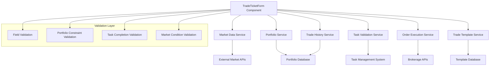

# Design Document

## Overview

The Trade Ticket Builder provides a comprehensive interface for creating, validating, and submitting trade orders across multiple brokerages while enforcing workflow discipline through blocking task validation. The system integrates with market data providers, portfolio management services, and the task management system to ensure trades align with the user's investment strategy and comply with established workflow requirements.

## Architecture

### High-Level Architecture



### Integration Points

1. **Task Management System**: Validates completion of blocking tasks
2. **Market Data Service**: Provides real-time market data for selected assets
3. **Portfolio Service**: Validates trades against portfolio constraints
4. **Brokerage APIs**: Executes trades on selected platforms (Fidelity, Robinhood, Coinbase)

## Components and Interfaces

### 1. TradeTicketForm Component

The main form component that orchestrates the trade creation process.

```typescript
interface TradeTicketFormProps {
  initialValues?: Partial<TradeOrder>;
  mode?: 'create' | 'edit' | 'view';
  templateId?: number;
  draftId?: number;
  onSubmit?: (order: TradeOrder) => Promise<void>;
  onSaveDraft?: (order: Partial<TradeOrder>) => Promise<void>;
  onSaveTemplate?: (template: TradeTemplate) => Promise<void>;
}

const TradeTicketForm: React.FC<TradeTicketFormProps> = ({
  initialValues,
  mode = 'create',
  templateId,
  draftId,
  onSubmit,
  onSaveDraft,
  onSaveTemplate
}) => {
  // Component implementation
};
```

### 2. BrokerageSelector Component

Allows selection of brokerage account with relevant details.

```typescript
interface BrokerageSelectorProps {
  accounts: BrokerageAccount[];
  selectedAccountId?: string;
  onChange: (accountId: string) => void;
  disabled?: boolean;
}

const BrokerageSelector: React.FC<BrokerageSelectorProps> = ({
  accounts,
  selectedAccountId,
  onChange,
  disabled = false
}) => {
  // Component implementation
};
```

### 3. AssetSelector Component

Provides search and selection of assets based on the selected brokerage.

```typescript
interface AssetSelectorProps {
  brokerageId: string;
  selectedAsset?: Asset;
  onChange: (asset: Asset) => void;
  disabled?: boolean;
}

const AssetSelector: React.FC<AssetSelectorProps> = ({
  brokerageId,
  selectedAsset,
  onChange,
  disabled = false
}) => {
  // Component implementation
};
```

### 4. OrderTypeForm Component

Displays appropriate fields based on the selected order type.

```typescript
interface OrderTypeFormProps {
  orderType: OrderType;
  asset?: Asset;
  currentPrice?: number;
  onChange: (values: Partial<OrderDetails>) => void;
  values: OrderDetails;
  errors: Record<string, string>;
  disabled?: boolean;
}

const OrderTypeForm: React.FC<OrderTypeFormProps> = ({
  orderType,
  asset,
  currentPrice,
  onChange,
  values,
  errors,
  disabled = false
}) => {
  // Component implementation
};
```

### 5. TaskValidationPanel Component

Displays blocking tasks that need completion before trade submission.

```typescript
interface TaskValidationPanelProps {
  isVisible: boolean;
  blockingTasks: TaskInstance[];
  onTaskComplete: (taskId: number) => Promise<void>;
  onTaskSkip: (taskId: number, reason: string) => Promise<void>;
}

const TaskValidationPanel: React.FC<TaskValidationPanelProps> = ({
  isVisible,
  blockingTasks,
  onTaskComplete,
  onTaskSkip
}) => {
  // Component implementation
};
```

### 6. MarketDataPanel Component

Displays real-time market data for the selected asset.

```typescript
interface MarketDataPanelProps {
  asset?: Asset;
  refreshInterval?: number;
}

const MarketDataPanel: React.FC<MarketDataPanelProps> = ({
  asset,
  refreshInterval = 5000
}) => {
  // Component implementation
};
```

### 7. PortfolioImpactPanel Component

Shows how the trade will impact portfolio metrics.

```typescript
interface PortfolioImpactPanelProps {
  order: Partial<TradeOrder>;
  portfolio: Portfolio;
}

const PortfolioImpactPanel: React.FC<PortfolioImpactPanelProps> = ({
  order,
  portfolio
}) => {
  // Component implementation
};
```

## Data Models

### TradeOrder Model

```typescript
interface TradeOrder {
  id?: number;
  brokerageAccountId: string;
  assetId: string;
  assetType: 'stock' | 'option' | 'crypto' | 'etf' | 'bond';
  orderType: 'market' | 'limit' | 'stop' | 'stop_limit';
  direction: 'buy' | 'sell';
  quantity: number;
  limitPrice?: number;
  stopPrice?: number;
  timeInForce: 'day' | 'gtc' | 'ioc' | 'fok';
  status: 'draft' | 'pending' | 'submitted' | 'executed' | 'canceled' | 'rejected';
  notes?: string;
  tags?: string[];
  estimatedValue: number;
  estimatedFees: number;
  createdAt: string;
  updatedAt: string;
  executedAt?: string;
  executedPrice?: number;
}
```

### BrokerageAccount Model

```typescript
interface BrokerageAccount {
  id: string;
  brokerageType: 'fidelity' | 'robinhood' | 'coinbase';
  name: string;
  accountNumber: string;
  balance: number;
  currency: string;
  isActive: boolean;
  lastSynced: string;
}
```

### Asset Model

```typescript
interface Asset {
  id: string;
  symbol: string;
  name: string;
  type: 'stock' | 'option' | 'crypto' | 'etf' | 'bond';
  exchange?: string;
  currentPrice?: number;
  dailyChange?: number;
  dailyChangePercent?: number;
  volume?: number;
  marketCap?: number;
  lastUpdated: string;
}
```

### TradeTemplate Model

```typescript
interface TradeTemplate {
  id?: number;
  name: string;
  description?: string;
  brokerageType: 'fidelity' | 'robinhood' | 'coinbase';
  assetType: 'stock' | 'option' | 'crypto' | 'etf' | 'bond';
  orderType: 'market' | 'limit' | 'stop' | 'stop_limit';
  direction: 'buy' | 'sell';
  timeInForce: 'day' | 'gtc' | 'ioc' | 'fok';
  notes?: string;
  tags?: string[];
  createdAt: string;
  updatedAt: string;
}
```

## API Endpoints

### Trade Order Endpoints

```
POST /api/trades
  - Request body: TradeOrder
  - Returns: Created TradeOrder with ID

GET /api/trades
  - Query parameters:
    - status: Filter by status
    - brokerageAccountId: Filter by account
    - assetType: Filter by asset type
    - direction: Filter by direction
    - fromDate: Filter by date range
    - toDate: Filter by date range
  - Returns: List of TradeOrder objects

GET /api/trades/{id}
  - Returns: TradeOrder by ID

PUT /api/trades/{id}
  - Request body: TradeOrder
  - Returns: Updated TradeOrder

DELETE /api/trades/{id}
  - Returns: Success status

POST /api/trades/{id}/submit
  - Returns: Submitted TradeOrder

POST /api/trades/{id}/cancel
  - Returns: Canceled TradeOrder
```

### Trade Draft Endpoints

```
POST /api/trades/drafts
  - Request body: Partial<TradeOrder>
  - Returns: Created draft with ID

GET /api/trades/drafts
  - Returns: List of draft TradeOrder objects

GET /api/trades/drafts/{id}
  - Returns: Draft TradeOrder by ID

PUT /api/trades/drafts/{id}
  - Request body: Partial<TradeOrder>
  - Returns: Updated draft

DELETE /api/trades/drafts/{id}
  - Returns: Success status

POST /api/trades/drafts/{id}/convert
  - Returns: Converted TradeOrder
```

### Trade Template Endpoints

```
POST /api/trades/templates
  - Request body: TradeTemplate
  - Returns: Created template with ID

GET /api/trades/templates
  - Returns: List of TradeTemplate objects

GET /api/trades/templates/{id}
  - Returns: TradeTemplate by ID

PUT /api/trades/templates/{id}
  - Request body: TradeTemplate
  - Returns: Updated template

DELETE /api/trades/templates/{id}
  - Returns: Success status

POST /api/trades/templates/{id}/create-order
  - Returns: New TradeOrder from template
```

### Task Validation Endpoints

```
GET /api/tasks/blocking-status
  - Returns: List of incomplete blocking tasks

POST /api/trades/validate
  - Request body: Partial<TradeOrder>
  - Returns: Validation result with any warnings or errors
```

## UI Design

### Desktop Layout

```
+-------------------------------------------------------+
| [Brokerage Selection]    [Asset Search]    [Order Type]|
+-------------------------------------------------------+
|                                                       |
| +-------------------+  +-------------------------+    |
| | Order Details     |  | Market Data             |    |
| | [Direction]       |  | [Price Chart]           |    |
| | [Quantity]        |  | [Current Price]         |    |
| | [Price Fields]    |  | [Daily Change]          |    |
| | [Time in Force]   |  | [Volume]                |    |
| +-------------------+  +-------------------------+    |
|                                                       |
| +-------------------+  +-------------------------+    |
| | Estimated Costs   |  | Portfolio Impact        |    |
| | [Order Value]     |  | [Allocation Change]     |    |
| | [Fees]            |  | [Risk Metrics]          |    |
| | [Total]           |  | [Diversification]       |    |
| +-------------------+  +-------------------------+    |
|                                                       |
| +-----------------------------------------------+    |
| | Task Validation                               |    |
| | [ ] Task 1 - Review portfolio drift           |    |
| | [ ] Task 2 - Check market conditions          |    |
| +-----------------------------------------------+    |
|                                                       |
| [Save Draft] [Save Template] [Cancel] [Submit Order]  |
+-------------------------------------------------------+
```

### Mobile Layout

```
+---------------------------+
| [Brokerage Selection]     |
+---------------------------+
| [Asset Search]            |
+---------------------------+
| [Order Type]              |
+---------------------------+
| Market Data               |
| [Price: $XX.XX]           |
| [Change: +/-X.X%]         |
+---------------------------+
| Order Details             |
| [Direction]               |
| [Quantity]                |
| [Price Fields]            |
| [Time in Force]           |
+---------------------------+
| Estimated Costs           |
| [Order Value: $XXX.XX]    |
| [Fees: $X.XX]             |
| [Total: $XXX.XX]          |
+---------------------------+
| Task Validation           |
| [ ] Task 1                |
| [ ] Task 2                |
+---------------------------+
| [Save Draft]              |
| [Submit Order]            |
+---------------------------+
```

## Validation Rules

### Field Validation

1. **Quantity**: Must be positive and within account limits
2. **Limit Price**: Required for limit and stop-limit orders
3. **Stop Price**: Required for stop and stop-limit orders
4. **Time in Force**: Required for all orders

### Portfolio Constraint Validation

1. **Allocation Limits**: Trade must not cause asset allocation to exceed defined limits
2. **Risk Metrics**: Trade must not increase portfolio risk beyond acceptable thresholds
3. **Cash Requirements**: Account must have sufficient funds for buy orders

### Task Completion Validation

1. **Blocking Tasks**: All blocking tasks must be completed before trade submission
2. **Task Recency**: Tasks must be completed within their valid timeframe

### Market Condition Validation

1. **Price Staleness**: Market data must be recent (within last 5 minutes)
2. **Trading Hours**: Validate that market is open for the selected asset
3. **Volatility Check**: Warn if asset volatility is abnormally high

## Error Handling

1. **Validation Errors**:
   - Display inline field errors with clear messages
   - Show summary of all errors at form level
   - Prevent submission until errors are resolved

2. **API Errors**:
   - Display toast notifications for API failures
   - Implement retry mechanism for transient errors
   - Preserve form data to prevent loss of input

3. **Brokerage API Errors**:
   - Handle specific error codes from each brokerage
   - Provide clear guidance on how to resolve issues
   - Log detailed error information for support

## Security Considerations

1. **Authentication**:
   - Require re-authentication for high-value trades
   - Implement session timeouts for security

2. **Authorization**:
   - Validate user permissions for each brokerage account
   - Restrict access based on user roles

3. **Data Protection**:
   - Encrypt sensitive order information
   - Mask account numbers in the UI
   - Implement audit logging for all trade actions

## Testing Strategy

1. **Unit Tests**:
   - Test form validation logic
   - Test component rendering with different props
   - Test utility functions

2. **Integration Tests**:
   - Test form submission flow
   - Test API integration
   - Test task validation integration

3. **End-to-End Tests**:
   - Test complete order creation and submission
   - Test draft and template functionality
   - Test error handling scenarios

4. **Mock Brokerage Testing**:
   - Create mock brokerage APIs for testing
   - Simulate various response scenarios
   - Test error handling for each brokerage