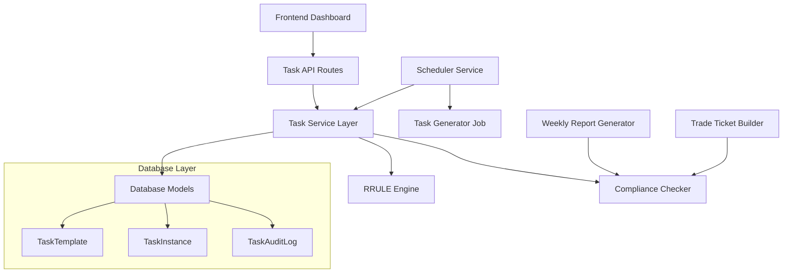

# Design Document

## Overview

The Weekly Task Management System integrates with the existing AIMS architecture to provide disciplined workflow enforcement through recurring task management. The system leverages the existing SQLAlchemy models, FastAPI routing structure, and APScheduler service to create a comprehensive task tracking solution that prevents weekly cycle closure until critical tasks are completed.

The design extends the current `TaskStatus` model and adds new components for task templates, RRULE parsing, and compliance tracking while maintaining consistency with the existing codebase patterns.

## Architecture

### High-Level Architecture



### Integration Points

1. **Existing Scheduler Service**: Extends `src/services/scheduler.py` to add task generation jobs
2. **Database Models**: Extends `src/db/models.py` with new task-related models
3. **API Routes**: Adds new router at `src/api/routes/tasks.py` following existing patterns
4. **Frontend Integration**: Integrates with existing React dashboard components

## Components and Interfaces

### 1. Database Models

#### TaskTemplate Model
```python
class TaskTemplate(Base):
    """Template for recurring tasks"""
    __tablename__ = "task_templates"
    
    id = Column(Integer, primary_key=True, index=True)
    name = Column(String(255), nullable=False)
    description = Column(Text, nullable=True)
    rrule = Column(String(500), nullable=False)  # RFC 5545 RRULE format
    is_blocking = Column(Boolean, default=False)
    category = Column(String(50), default="general")  # daily, weekly, monthly
    priority = Column(Integer, default=1)  # 1=high, 2=medium, 3=low
    estimated_duration = Column(Integer, nullable=True)  # minutes
    is_active = Column(Boolean, default=True)
    created_at = Column(DateTime, server_default=func.now())
    updated_at = Column(DateTime, server_default=func.now(), onupdate=func.now())
```

#### TaskInstance Model (extends existing TaskStatus)
```python
class TaskInstance(Base):
    """Individual task instances generated from templates"""
    __tablename__ = "task_instances"
    
    id = Column(Integer, primary_key=True, index=True)
    template_id = Column(Integer, ForeignKey("task_templates.id"), nullable=False)
    name = Column(String(255), nullable=False)
    description = Column(Text, nullable=True)
    due_date = Column(DateTime, nullable=False, index=True)
    status = Column(String(20), default="pending")  # pending, in_progress, completed, skipped
    is_blocking = Column(Boolean, default=False)
    priority = Column(Integer, default=1)
    completed_at = Column(DateTime, nullable=True)
    completed_by = Column(String(100), nullable=True)  # user identifier
    notes = Column(Text, nullable=True)
    created_at = Column(DateTime, server_default=func.now())
    updated_at = Column(DateTime, server_default=func.now(), onupdate=func.now())
```

#### TaskAuditLog Model
```python
class TaskAuditLog(Base):
    """Audit trail for task changes"""
    __tablename__ = "task_audit_log"
    
    id = Column(Integer, primary_key=True, index=True)
    task_instance_id = Column(Integer, ForeignKey("task_instances.id"), nullable=False)
    action = Column(String(50), nullable=False)  # created, started, completed, skipped, modified
    old_status = Column(String(20), nullable=True)
    new_status = Column(String(20), nullable=True)
    user_id = Column(String(100), nullable=True)
    notes = Column(Text, nullable=True)
    timestamp = Column(DateTime, server_default=func.now(), index=True)
```

### 2. Service Layer

#### TaskService Class
```python
class TaskService:
    """Core service for task management operations"""
    
    def __init__(self):
        self.rrule_parser = RRuleParser()
        self.compliance_checker = ComplianceChecker()
    
    async def create_task_template(self, template_data: TaskTemplateCreate) -> TaskTemplate
    async def update_task_template(self, template_id: int, template_data: TaskTemplateUpdate) -> TaskTemplate
    async def delete_task_template(self, template_id: int) -> bool
    async def get_task_templates(self, active_only: bool = True) -> List[TaskTemplate]
    
    async def generate_task_instances(self, start_date: date, end_date: date) -> List[TaskInstance]
    async def get_pending_tasks(self, user_id: str = None) -> List[TaskInstance]
    async def get_overdue_tasks(self, user_id: str = None) -> List[TaskInstance]
    
    async def complete_task(self, task_id: int, user_id: str, notes: str = None) -> TaskInstance
    async def skip_task(self, task_id: int, user_id: str, reason: str) -> TaskInstance
    async def update_task_status(self, task_id: int, status: str, user_id: str) -> TaskInstance
    
    async def get_compliance_metrics(self, start_date: date, end_date: date) -> ComplianceMetrics
    async def check_blocking_tasks_complete(self, date: date = None) -> BlockingTasksStatus
```

#### RRuleParser Class
```python
class RRuleParser:
    """Handles RRULE parsing and task generation"""
    
    def parse_rrule(self, rrule_string: str) -> rrule
    def validate_rrule(self, rrule_string: str) -> ValidationResult
    def generate_occurrences(self, rrule_string: str, start_date: date, end_date: date) -> List[datetime]
    def get_next_occurrence(self, rrule_string: str, after_date: datetime) -> datetime
```

#### ComplianceChecker Class
```python
class ComplianceChecker:
    """Handles compliance checking and blocking logic"""
    
    async def check_weekly_cycle_ready(self, db: Session, date: date = None) -> CycleReadinessStatus
    async def get_blocking_tasks(self, db: Session, date: date = None) -> List[TaskInstance]
    async def calculate_compliance_rate(self, db: Session, start_date: date, end_date: date) -> float
    async def get_compliance_trends(self, db: Session, weeks: int = 12) -> List[WeeklyCompliance]
```

### 3. API Routes

#### Task Management Endpoints
```python
# GET /api/tasks - Get all pending tasks
# GET /api/tasks/overdue - Get overdue tasks
# GET /api/tasks/compliance - Get compliance metrics
# POST /api/tasks/{task_id}/complete - Mark task as complete
# POST /api/tasks/{task_id}/skip - Skip a task
# PUT /api/tasks/{task_id}/status - Update task status

# Template management
# GET /api/tasks/templates - Get task templates
# POST /api/tasks/templates - Create task template
# PUT /api/tasks/templates/{template_id} - Update template
# DELETE /api/tasks/templates/{template_id} - Delete template

# Compliance checking
# GET /api/tasks/blocking-status - Check if blocking tasks are complete
# GET /api/tasks/weekly-readiness - Check if weekly cycle can close
```

### 4. Frontend Components

#### NextActionsWidget Component
```typescript
interface NextActionsWidgetProps {
  tasks: TaskInstance[];
  onTaskComplete: (taskId: number, notes?: string) => void;
  onTaskSkip: (taskId: number, reason: string) => void;
}

const NextActionsWidget: React.FC<NextActionsWidgetProps> = ({
  tasks,
  onTaskComplete,
  onTaskSkip
}) => {
  // Render task list with color coding
  // Handle task interactions
  // Show compliance status
};
```

#### TaskManagementPage Component
```typescript
const TaskManagementPage: React.FC = () => {
  // CRUD operations for task templates
  // RRULE builder/editor
  // Task history and audit log
  // Compliance reporting
};
```

## Data Models

### Core Data Structures

#### TaskTemplateCreate Schema
```python
class TaskTemplateCreate(BaseModel):
    name: str = Field(..., max_length=255)
    description: Optional[str] = None
    rrule: str = Field(..., max_length=500)
    is_blocking: bool = False
    category: str = Field(default="general", max_length=50)
    priority: int = Field(default=1, ge=1, le=3)
    estimated_duration: Optional[int] = Field(None, ge=1)
```

#### TaskInstance Schema
```python
class TaskInstanceResponse(BaseModel):
    id: int
    template_id: int
    name: str
    description: Optional[str]
    due_date: datetime
    status: str
    is_blocking: bool
    priority: int
    completed_at: Optional[datetime]
    notes: Optional[str]
    overdue: bool
    color_code: str  # green, yellow, red
```

#### ComplianceMetrics Schema
```python
class ComplianceMetrics(BaseModel):
    period_start: date
    period_end: date
    total_tasks: int
    completed_tasks: int
    skipped_tasks: int
    overdue_tasks: int
    compliance_rate: float
    daily_compliance_rate: float
    weekly_compliance_rate: float
    blocking_tasks_complete: bool
```

## Error Handling

### Task-Specific Error Types
```python
class TaskNotFoundError(HTTPException):
    def __init__(self, task_id: int):
        super().__init__(status_code=404, detail=f"Task {task_id} not found")

class InvalidRRuleError(HTTPException):
    def __init__(self, rrule: str, error: str):
        super().__init__(status_code=400, detail=f"Invalid RRULE '{rrule}': {error}")

class BlockingTasksIncompleteError(HTTPException):
    def __init__(self, blocking_tasks: List[str]):
        super().__init__(
            status_code=409, 
            detail=f"Cannot proceed: blocking tasks incomplete: {', '.join(blocking_tasks)}"
        )
```

### Error Handling Strategy
1. **Validation Errors**: Return 400 with specific field errors
2. **RRULE Parsing Errors**: Return 400 with RRULE syntax help
3. **Blocking Task Errors**: Return 409 with list of incomplete blocking tasks
4. **Database Errors**: Log and return 500 with generic message
5. **Scheduler Errors**: Log and continue with next scheduled run

## Testing Strategy

### Unit Tests
1. **RRuleParser Tests**: Test RRULE parsing, validation, and occurrence generation
2. **TaskService Tests**: Test all CRUD operations and business logic
3. **ComplianceChecker Tests**: Test blocking logic and compliance calculations
4. **Model Tests**: Test database model relationships and constraints

### Integration Tests
1. **API Endpoint Tests**: Test all task management endpoints
2. **Scheduler Integration**: Test task generation jobs
3. **Database Integration**: Test model persistence and queries
4. **Frontend Integration**: Test component interactions with API

### End-to-End Tests
1. **Weekly Workflow**: Test complete weekly cycle with blocking tasks
2. **Task Template Lifecycle**: Test template creation, task generation, and completion
3. **Compliance Reporting**: Test compliance metrics calculation and reporting
4. **Error Scenarios**: Test error handling for various failure modes

### Test Data Setup
```python
# Sample task templates for testing
SAMPLE_TEMPLATES = [
    {
        "name": "Morning Review: Check signals",
        "rrule": "RRULE:FREQ=DAILY;BYDAY=MO,TU,WE,TH,FR;BYHOUR=8",
        "is_blocking": False,
        "category": "daily"
    },
    {
        "name": "Review portfolio drift",
        "rrule": "RRULE:FREQ=WEEKLY;BYDAY=FR;BYHOUR=14",
        "is_blocking": True,
        "category": "weekly"
    },
    {
        "name": "Approve trade ticket",
        "rrule": "RRULE:FREQ=WEEKLY;BYDAY=FR;BYHOUR=15",
        "is_blocking": True,
        "category": "weekly"
    }
]
```